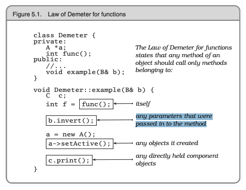
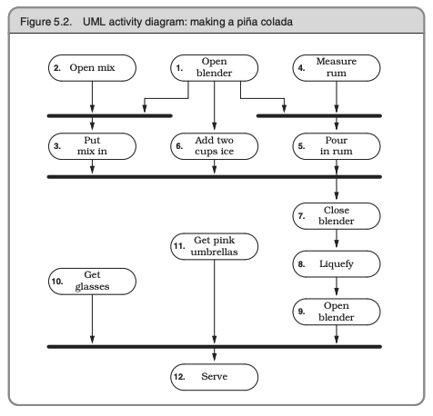
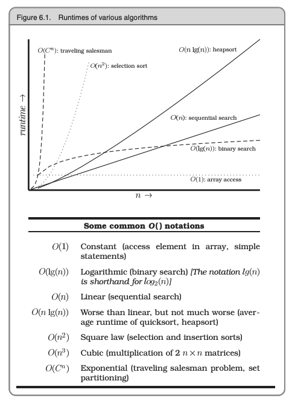

## Chapter 5

### Decoupling and the Law of Demeter
- minimize coupling -  careful about how many other modules you
interact with and, more importantly, how you came to interact with
them.
- think of a general contractor. Ex. You deal with a main builder contractor and
he deals with other subcontractors (plumbing, roofing etc.)
- In order to keep the dependencies to a minimum, we’ll use the Law of Demeter to design
our methods and functions.
- In practice, this means that you will be writing
a large number of wrapper methods that simply forward the request on
to a delegate. These wrapper methods will impose both a runtime cost
and a space overhead, which may be significant—even prohibitive—in
some applications.

The Law of Demeter for functions states that any method of an object should call only methods
belonging to:

### Metaprogramming

- Put Abstractions in Code, Details in Metadata
- not a lot of modern languages support metaprogramming
- metaprogramming is close to writing actual rules. You're writing the same thing that you're saying.
- trying to be close to user's language

### Temporal Coupling

- Temporal Coupling is about time, the role of time as a design element of the software.
- We need to allow for concurrency, and to think about decoupling any
time or order dependencies.  In doing so, we can gain flexibility and
reduce any time-based dependencies in many areas of development:
workflow analysis, architecture, design, and deployment.
- Use UML activity diagrams to maximize parallelism by identifying
activities that could be performed in parallel, but aren’t. Once all the actions leading into a synchronization bar are complete, you can then proceed along any arrows leaving the bar. An action with _no arrows_ leading into it can be started at any time.

- design using services. Services (independent, concurrent objects behind well-defined, consistent interfaces) should be decoupled from each other.
- Objects must always be in a valid state when called, and they can be called at the most awkward times
- Design for concurrency

### It's just a view

- Separate Views from Models
- MVC

### Blackboards

- A blackboard, in combination with a rules engine that encapsulates the
legal requirements, is an elegant solution to the difficulties found here.
Order of data arrival is irrelevant: when a fact is posted it can trigger
the appropriate rules. Feedback is easily handled as well: the output of
any set of rules can post to the blackboard and cause the triggering of
yet more applicable rules

- Use Blackboards to Coordinate Workflow

## Chapter 6

### Programming by coincidence

- For code you write that others will call, the basic principles of good
modularization and of hiding implementation behind small, well-documented interfaces can all help.

- Don’t Program by Coincidence. Assumptions that aren’t based on well-established
facts are the bane of all projects.

### Algorithm Speed

- Estimate and test the order of your algorithms

### Refactoring

- Writing software is like gardening. Rewriting, reworking, and re-architecting code is collectively known as
refactoring

- Any number of things may cause code to qualify for refactoring:
    - Duplication. You’ve discovered a violation of the DRY principle
    - Nonorthogonal design. You’ve discovered some code or design that could be made more orthogonal ("Changing A does not change B")
    - Outdated knowledge. Things change, requirements drift, and your knowledge of the problem increases. Code needs to keep up.
    - Performance. You need to move functionality from one area of the system to another to improve performance.

- Refactor early, refactor often

- Don’t try to refactor and add functionality at the same time.

- Make sure you have good tests

### Code that's easy to test

- Design to test. When you design a module, or even a single routine, you should design
both its contract and the code to test that contract. By designing code
to pass a test and fulfill its contract, you may well consider boundary conditions and other issues that wouldn’t occur to you otherwise.

- By making the test code readily accessible, you are providing developers
who may use your code with two invaluable resources:
    - Examples of how to use all the functionality of your module

    - A means to build regression tests to validate any future changes to the code

- All software you write will be tested—if not by you and your team,
then by the eventual users

- Don’t Use Wizard Code You Don’t Understand

## Chapter 7

- Don't gather requirementes, dig for them
- Work with a user to think like a user
- Abstractions live longer than details
- Use a project glossary
- Don't think outside the box - find the box
- Listen to nagging doubts - start when you're ready