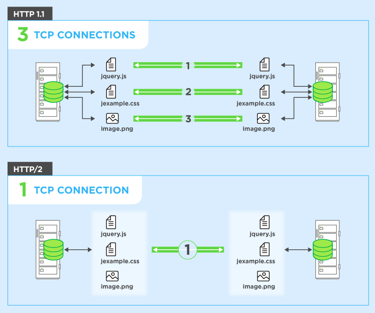

## HTTP

HTTP is based on the Client/Server model. Client/Server model can be explained as two computers, Client (receiver of service) and Server (provider of service) that are communicating via requests and responses.

### Request multiplexing

HTTP/2 can send multiple requests for data in parallel over a single TCP connection. This is the most advanced feature of the HTTP/2 protocol because it allows you to download web files asynchronously from one server.

### Header compression
HTTP/2 compress a large number of redundant header frames. It uses the HPACK specification as a simple and secure approach to header compression

### HTTP/2 Server Push
Consider a website with three resources: index.html, styles.css and script.js. Server will scan index.html, will anticipate that it will need styles.css and script.js and push it to the client while it still might be rendering index.html. A client won't need to send additional requests for styles.css and script.js