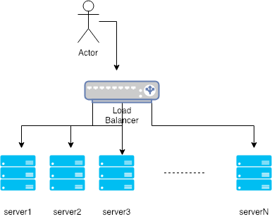

# Scalability

## Clones

A user should always get the same results of his request back, independent what server he  “landed on”. That leads to the first golden rule for scalability: **every server contains exactly the same codebase and does not store any user-related data, like sessions or profile pictures, on local disc or memory**.

Sessions need to be stored in a centralized data store which is accessible to all your application servers. It can be an external database or an external persistent cache, like Redis. An external persistent cache will have better performance than an external database. By external I mean that the data store does not reside on the application servers.

## Databases

Scenario: Somewhere down the road your application gets slower and slower and finally breaks down. The reason: your database - MySQL.

Path #1: stick to MySQL and do master-slave replication (read from slaves, write to master) and upgrade your master server by adding RAM, RAM and more RAM (vertical scaling).

Path #2: means to denormalize right from the beginning and include no more Joins in any database query. You can stay with MySQL, and use it like a NoSQL database, or you can switch to a better and easier to scale NoSQL database like MongoDB or CouchDB. Joins will now need to be done in your application code. 

However, app users still have to suffer slow page requests when a lot of data is fetched from the database. The solution is the implementation of a cache (in-memory caches like Memcached or Redis). Never file-based caching, cause it makes cloning and auto-scaling of servers just a pain.

## Caches

There are 2 patterns of caching your data.

*#1 - Cached Database Queries*
 Whenever you do a query to your database, you store the result dataset in cache. A hashed version of your query is the cache key. The main issue is the expiration. When one piece of data changes (for example a table cell) you need to delete all cached queries who may include that table cell. 

 *#2 Cached Objects*
 Recommended. Let your class assemble a dataset from your database and then store the complete instance of the class or the assembed dataset in the cache. You have, for example, a class called “Product” which has a property called “data”. It is an array containing prices, texts, pictures, and customer reviews of your product. The property “data” is filled by several methods in the class doing several database requests which are hard to cache, since many things relate to each other. Now, do the following: when your class has finished the “assembling” of the data array, directly store the data array, or better yet the complete instance of the class, in the cache. And the best part: it makes asynchronous processing possible! Just imagine an army of worker servers who assemble your objects for you! The application just consumes the latest cached object and nearly never touches the databases anymore!

 ## Asynchronism

 One of the methods for asynch processing is to use ex. RabbitMQ or ActiveMQ. The basic idea is to have a queue of tasks or jobs that a worker can process. 

 ## Use case: bitly
 https://github.com/donnemartin/system-design-primer/blob/master/solutions/system_design/pastebin/README.md